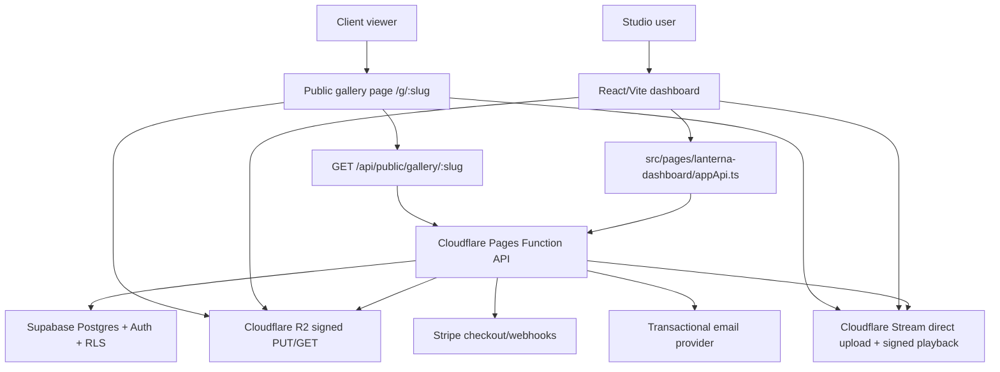
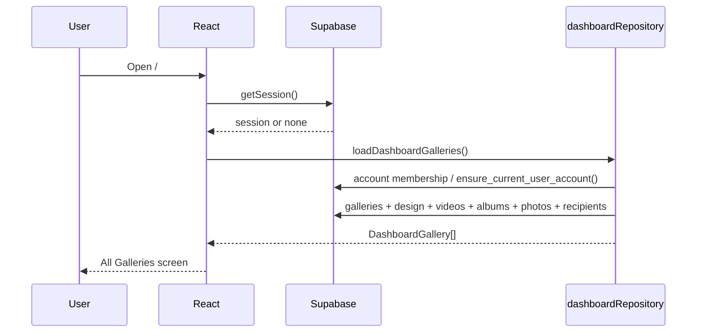
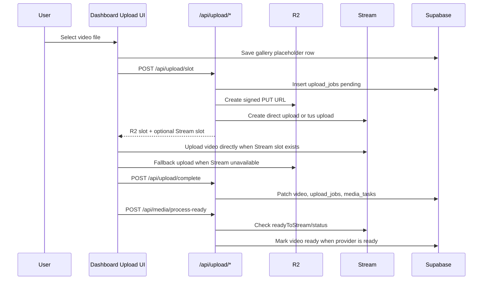
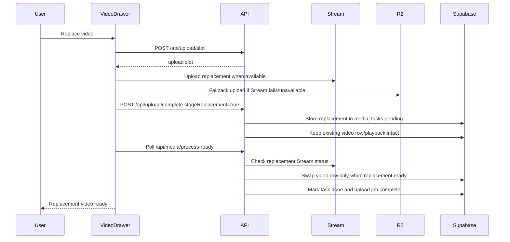
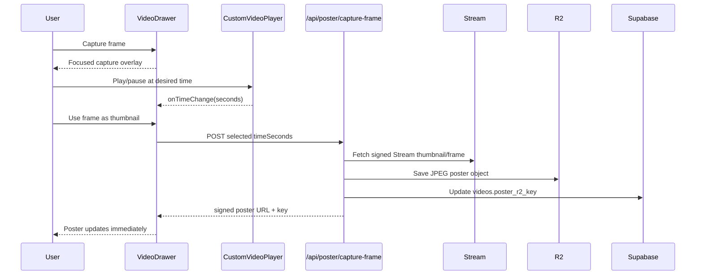
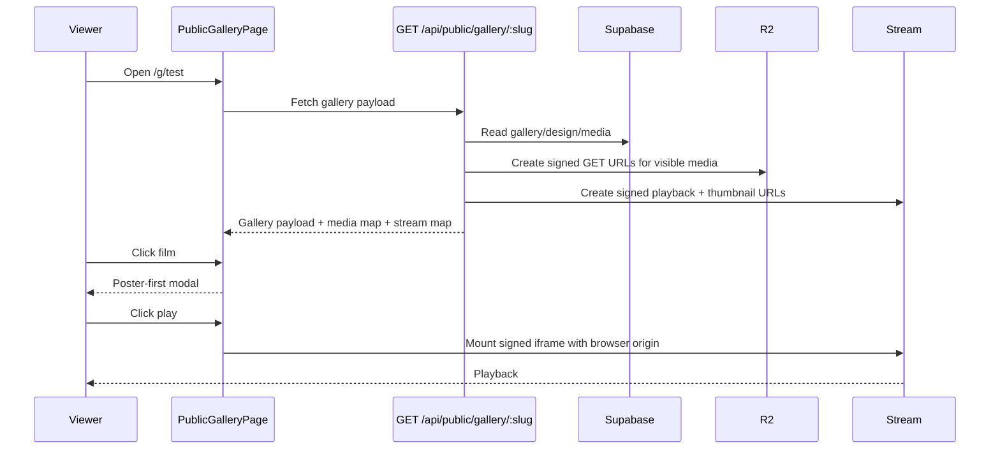
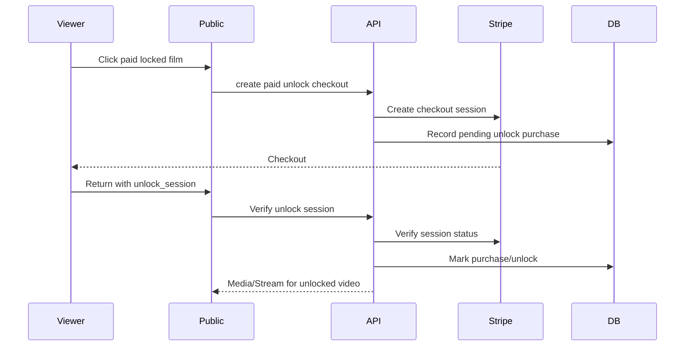

# Lanterna Audit Packet

Generated: 2026-07-06  
Repo: `/Users/cliftonlawson/Desktop/LANTERNA_GITHUB`  
Primary local URL: `http://127.0.0.1:5173/`  
Public smoke gallery: `http://127.0.0.1:5173/g/test`

This packet is a sanitized, repo-local handoff for another system or engineer to audit Lanterna end to end. It intentionally does not include `.env.local`, secret values, bearer tokens, service keys, Stripe secrets, Cloudflare tokens, Supabase keys, or full signed media URLs.

## 1. Executive Summary

Lanterna is a delivery platform for wedding and portrait studios. The core product is a studio dashboard where a filmmaker creates galleries, uploads films/photos/backgrounds, customizes a client-facing gallery, sends delivery links, and optionally sells paid unlock films.

The current build is a React/Vite app with Supabase persistence, Cloudflare Pages-style API routes, Cloudflare R2 for object storage, Cloudflare Stream for signed video playback, Stripe checkout hooks for paid unlocks, and a local fallback layer for demo mode.

Recent focus was on making video delivery real rather than simulated:

- Supabase migrations are applied.
- R2 upload paths work for photos, posters, and backgrounds.
- Cloudflare Stream direct upload is wired, including larger-file `tus` fallback.
- Signed Cloudflare Stream playback URLs are generated server-side.
- The public gallery and dashboard drawer use Stream iframe playback when available, falling back to R2 video URLs.
- Stream thumbnail URLs are exposed and used as poster fallback.
- The custom player now behaves like a polished delivery player: poster first, centered play button, no auto-mounted iframe before click, thin progress line, hover-only controls, pause/mute/back/fullscreen controls, and 16:9 framing.
- The thumbnail capture flow exists: open Capture Frame, play/seek normally, click Use frame as thumbnail, save the captured frame back into R2/Supabase, and update the drawer/card immediately.
- Replacement upload logic stages Stream replacements until Cloudflare reports ready, avoiding swapping visible playback to a not-ready Stream asset.
- Upload queue and stale placeholder bugs were repaired.
- A repeatable smoke check exists at `npm run smoke:gallery`.

The main remaining human-needed verification is the native file picker path: selecting a real local file through Add files or Replace video in the signed-in browser. The in-app browser automation can click the buttons but cannot attach a local file to the hidden file input.

## 2. Source Of Truth Files

Product/schema/infrastructure:

- `Lanterna_schema_spec.md`
- `Lanterna_infrastructure_SOP.md`
- `Lanterna_backend_reuse_map.md`
- `Lanterna_frontend_scaffold_notes.md`
- `Lanterna_supabase_readiness.md`
- `README.md`

Core frontend:

- `src/App.tsx`
- `src/pages/ClaudeDashboard.tsx`
- `src/pages/PublicGalleryPage.tsx`
- `src/pages/lanterna-dashboard/AllGalleriesScreen.tsx`
- `src/pages/lanterna-dashboard/GalleryStudioScreen.tsx`
- `src/pages/lanterna-dashboard/UploadScreen.tsx`
- `src/pages/lanterna-dashboard/VideoDrawer.tsx`
- `src/pages/lanterna-dashboard/CustomVideoPlayer.tsx`
- `src/pages/lanterna-dashboard/dashboardRepository.ts`
- `src/pages/lanterna-dashboard/schemaMapper.ts`
- `src/pages/lanterna-dashboard/appApi.ts`
- `src/pages/lanterna-dashboard/model.ts`

Core backend/API:

- `functions/api/[[path]].js`
- `src/server/lanternaApi.js`
- `src/server/cloudflareStream.js`
- `src/server/r2Signing.js`
- `src/server/supabaseRest.js`
- `src/server/stripeCheckout.js`
- `src/server/galleryAccess.js`

Data/migrations:

- `supabase/migrations/20260630011015_lanterna_initial_schema.sql`
- `supabase/migrations/20260701105500_lanterna_state_machine_triggers.sql`
- `supabase/migrations/20260701120500_lanterna_usage_allowance_defaults.sql`
- `supabase/migrations/20260701182000_gallery_design_layout_default_lumen.sql`
- `supabase/migrations/20260701183000_ensure_current_user_account.sql`
- `supabase/migrations/20260702101000_gallery_design_google_fonts.sql`
- `supabase/migrations/20260702102000_gallery_design_heading_eyebrow.sql`
- `supabase/migrations/20260702152500_video_paid_unlocks.sql`
- `supabase/migrations/20260702165000_video_unlock_purchase_constraints.sql`
- `supabase/migrations/20260702170500_video_unlock_purchase_full_stripe_session_unique.sql`

QA/smoke:

- `scripts/smoke-gallery.mjs`
- `public/favicon.svg`

## 3. Product Intent

Lanterna is not a generic file-sharing app. It is a filmmaker delivery experience.

Primary audience:

- Wedding filmmakers and portrait studios.
- Their clients, who receive a polished gallery link with no app install.

Primary jobs:

- Upload high-quality video and image deliverables.
- Let the studio style the client-facing gallery.
- Deliver a gallery link.
- Keep playback fast, secure, and visually refined.
- Preserve proof of delivery.
- Track upload/storage usage.
- Sell optional paid bonus films.

Product posture:

- Delivery gallery should feel like a premiere, not a folder.
- Dashboard should be operational and repeatable, not marketing-like.
- Public playback should reveal media only when the viewer asks to play.
- Upload/replacement should favor not breaking existing playback while processing.

## 4. High-Level Architecture



Security boundary:

- Authenticated studio/dashboard operations go through Supabase session bearer tokens.
- Server routes validate current user, account membership, gallery access, and provider requests.
- Public gallery reads do not rely on Supabase RLS. They go through a server route that enforces public/password/private access and returns signed, scoped media URLs.
- R2 media is accessed through short-lived signed URLs.
- Stream playback is accessed through signed Stream tokens.

## 5. Data Model Summary

The schema spec’s central principle is account-scoped ownership. Important entities:

- `users`: profile/auth companion data.
- `accounts`: studio/workspace owner entity.
- `account_members`: membership boundary for RLS.
- `vendor_branding`: account-wide brand defaults.
- `galleries`: client-facing gallery records.
- `gallery_design`: per-gallery visual/editor state.
- `videos`: film records, R2/Stream references, poster refs, paid-unlock fields.
- `albums`: photo grouping.
- `photos`: photo records and R2 refs.
- `deliveries`: append-only send records.
- `delivery_recipients`: denormalized recipient status.
- `delivery_events`: append-only proof events.
- `upload_jobs`: resumable/visible upload state.
- `media_tasks`: durable outbox for provider-backed work.
- `subscriptions`, `entitlements`, `account_usage`, `usage_events`: billing/usage tracking.
- `video_unlock_purchases`: paid unlock checkout/session records.

Current migrations implement:

- Initial account-scoped schema and RLS.
- Upload/media state machine triggers.
- Usage allowance defaults.
- Gallery design layout defaults.
- Account self-healing RPC.
- Google font settings.
- Heading eyebrow.
- Paid unlock video columns and Stripe session uniqueness.

## 6. Infrastructure Summary

Recommended stack from the SOP:

- Supabase Auth/Postgres/RLS for app data.
- Cloudflare R2 for originals, posters, photos, backgrounds, music, and downloadable assets.
- Cloudflare Stream for browser playback.
- Cloudflare Pages/Workers-style functions for API/provider boundaries.
- Stripe for paid unlock and subscriptions.
- Transactional email provider for delivery notifications.

Storage path pattern:

```text
{accountId}/{galleryId}/{targetType}/{targetId}/{fileName}
```

Examples observed in the test gallery:

- Background object: account/gallery/backgrounds/hero/original.jpg
- Poster object: account/gallery/films/video-id/poster.jpg
- Video R2 object: account/gallery/films/video-id/original.mov

Sensitive configuration lives in `.env.local` locally and should never be copied into audit material.

## 7. Frontend Structure

Main routes:

- `/`: authenticated dashboard if signed in; marketing/landing if not.
- `/g/:slug`: public gallery route.
- Auth routes are handled through `src/pages/Auth.tsx` and Supabase context.

Dashboard state is managed by:

- `ClaudeDashboard.tsx`: top-level dashboard orchestration.
- `dashboardRepository.ts`: load/save between Supabase and local fallback.
- `schemaMapper.ts`: camelCase UI model to snake_case schema rows.
- `model.ts`: shared view model types.

Key dashboard screens:

- All Galleries
- Gallery Studio
- Upload
- Vendor Dashboard
- Account
- Video Drawer
- New Gallery Modal

Public gallery flow:

- `PublicGalleryPage.tsx` fetches `GET /api/public/gallery/:slug`.
- Password-protected galleries show a password gate.
- Public payload maps back into the dashboard gallery preview components so Studio preview and public gallery share presentation logic.
- Film selection opens `PublicFilmPlayer`.
- Paid locked films open `PublicPaidUnlockModal`.

## 8. Design System And Gallery Layouts

The UI leans cinematic, editorial, and restrained:

- Dark dashboard shell with warm accent `#FFB24D`.
- Public gallery default theme is `lumen`.
- Typography supports editorial headline/body pairing.
- Layout browser exposes multiple gallery templates.
- Cards and controls are compact and operational in the dashboard.
- Public gallery is visual-first and media-forward.

Gallery layout templates in the current model:

- `lumen`
- `diptych`
- `meridian`
- `grove`
- `atelier`
- `reel`
- `overture`
- `passage`
- `salon`

Design fields:

- `heading_title`
- `heading_eyebrow`
- `heading_subtitle`
- `layout_template`
- `background_type`
- `background_r2_key`
- `theme`
- `accent_color`
- `typography`
- `headline_font`
- `headline_font_weight`
- `body_font`
- `body_font_weight`
- `music_track_r2_key`
- `featured_video_id`
- `enabled_buttons`
- `allow_downloads`

Player design behavior:

- 16:9 frame.
- Poster image or Stream thumbnail fallback before play.
- Center play button.
- No Stream iframe mounted until viewer clicks play.
- Controls appear on hover/focus within the frame.
- Thin progress line.
- Pause, back 10 seconds, mute/unmute, fullscreen/exit fullscreen.
- Native Stream controls are hidden; custom controls are the visible control layer.

## 9. Core User Flows

### 9.1 Studio Login And Dashboard Hydration



Important behavior:

- Existing users without account membership can self-heal through `ensure_current_user_account`.
- If Supabase is unavailable, the app falls back to localStorage.

### 9.2 Upload New Video



Important behavior:

- Stream is preferred for video playback.
- R2 is fallback for video and primary for photos/background/posters.
- Files over `200 MB` route to Stream `tus` upload.
- TIFF poster uploads are blocked in the UI; poster uploads accept JPG/PNG/WebP.

### 9.3 Replace Video



Critical product decision:

- Replacement is in-place but staged.
- Existing public playback should not break while the replacement is processing.
- Poster is cleared when replacement becomes ready, so Stream thumbnail can become fallback until a custom/captured poster is set.

### 9.4 Capture Frame As Thumbnail



Observed fix:

- Captured frame was originally about a second early.
- The current flow saves the chosen capture time and updates the visible drawer/card without requiring close/reopen.

### 9.5 Public Gallery Playback



Important playback detail:

- Generic `iframe.videodelivery.net` returned 403 for signed iframes.
- Local env now uses customer host via `CLOUDFLARE_STREAM_CUSTOMER_CODE=uw4q29yw83znxcyo`.
- The signed iframe works when loaded with the expected origin/referer.

### 9.6 Paid Unlock



Recent related repair:

- Paid-unlock R2 payload now returns signed URL strings in the expected shape instead of nested objects where the client expected strings.

## 10. Backend API Surface

Important authenticated routes:

- `POST /api/upload/slot`
- `POST /api/upload/complete`
- `POST /api/media/process-ready`
- `POST /api/media/urls`
- `POST /api/background/slot`
- `POST /api/background/complete`
- `POST /api/poster/slot`
- `POST /api/poster/complete`
- `POST /api/poster/capture-frame`
- `POST /api/delivery/notify`
- Paid unlock/Stripe routes in `stripeCheckout.js`

Important public routes:

- `GET /api/public/gallery/:slug`
- password unlock route for protected galleries
- paid unlock verification route

Provider helpers:

- `cloudflareStream.js`: direct upload, `tus`, signed tokens, iframe URL, thumbnail URL, Stream status polling.
- `r2Signing.js`: R2 signed PUT/GET URLs.
- `supabaseRest.js`: service-role REST boundary and current-user/account membership helpers.

## 11. Recent Fix Log

Playback/player:

- Public player and dashboard drawer prefer Stream iframe playback, then R2 fallback.
- Stream iframe is not mounted until play is clicked.
- Poster/thumbnail displays before playback.
- Center play button restored to visible triangle styling.
- Controls hide when pointer leaves the frame and return on hover/focus.
- Progress changed from circular styling to thin line.
- Frame constrained to 16:9.
- Fullscreen enter/exit button behavior fixed.
- Removed unnecessary overlay text from video frame.

Thumbnail/poster:

- Stream JPEG thumbnail exposed as fallback.
- Uploaded/captured poster updates immediately in drawer and video card.
- TIFF poster upload blocked going forward.
- Capture Frame flow added with focused overlay and Use frame as thumbnail action.
- Capture save writes a poster object and updates `videos.poster_r2_key`.

Replacement upload:

- Replace Video button repaired.
- Large files route through Stream `tus` when above threshold.
- Replacement uploads stage in `media_tasks` and do not swap the visible video row until Stream is ready.
- Drawer shows more obvious processing/encoding state.
- Polling uses `processUploadedVideos(galleryId, videoId)` and Supabase state, not only local drawer state.

Processing/data cleanup:

- `media_tasks.status` now uses schema-valid `done` instead of invalid `complete`.
- `processReady` returns `processedVideoIds`.
- Dashboard avoids blanket-marking every processing row ready.
- Server cleans stale pending `generate_web_copy` tasks when a video is already ready with a playable asset.
- Orphan upload placeholder row in test gallery was soft-deleted.
- Upload queue now filters orphan jobs, active dead jobs, and duplicate historical terminal rows.
- Clearing queue rows now clears the relevant Supabase upload jobs too.

Public links:

- Public gallery links use `/g/:slug`.
- Server delivery fallback and dashboard share paths aligned to public gallery route.

Paid unlock:

- R2 signed URL payload shape fixed for unlocked media.

Smoke/ops:

- Added `scripts/smoke-gallery.mjs`.
- Added `npm run smoke:gallery`.
- Added `public/favicon.svg` and linked it from `index.html`.

## 12. Current Test Gallery State

Gallery:

```json
{
  "id": "e67768d8-8633-45aa-8935-1854127147e8",
  "slug": "test",
  "name": "test",
  "status": "draft",
  "access_type": "public",
  "event_date": "2026-06-06"
}
```

Design:

```json
{
  "layout_template": "lumen",
  "background_type": "image",
  "background_r2_key": "present",
  "theme": "dark",
  "accent_color": "#FFB24D",
  "typography": "editorial",
  "heading_title": "test",
  "heading_subtitle": "June 4, 2026 · Villa Toscana",
  "heading_eyebrow": "The Wedding Film"
}
```

Active videos:

```json
[
  {
    "id": "6108c581-dce0-42ca-bca7-167246d7e436",
    "title": "Addie and Seve Teaser 4K",
    "duration_seconds": 0,
    "processing_status": "ready",
    "source": "r2",
    "poster": "none"
  },
  {
    "id": "1b9101f6-1246-41cd-ae25-684b3cfcd843",
    "title": "AD VIDEO HD 1080p",
    "duration_seconds": 68,
    "processing_status": "ready",
    "source": "cloudflare-stream",
    "stream_ready": true,
    "poster": "stream thumbnail fallback"
  },
  {
    "id": "128a463a-e89e-4c64-be10-d4f65dd8cc45",
    "title": "Lanterna Smoke 2026-07-04T17-59-50-037Z",
    "duration_seconds": 4,
    "processing_status": "ready",
    "source": "cloudflare-stream",
    "stream_ready": true,
    "poster": "custom/captured R2 poster"
  }
]
```

Task/job counts as of 2026-07-06:

```json
{
  "mediaTaskCounts": {
    "reconcile_usage:pending": 13,
    "generate_web_copy:done": 6
  },
  "uploadJobCounts": {
    "video:complete": 2
  }
}
```

Interpretation:

- `generate_web_copy` tasks are clean for the test gallery.
- Two upload jobs remain, both completed and tied to real video targets.
- Pending `reconcile_usage` tasks remain. These are bookkeeping/usage tasks, not playback blockers. A future audit should decide whether they need a worker, cleanup job, or schema-level lifecycle.

## 13. Verification Results

Fresh local verification on 2026-07-06:

```bash
npm run typecheck
# passed

npm run lint
# passed

npm run build
# passed

npm run smoke:gallery -- test "Lanterna Smoke 2026-07-04T17-59-50-037Z"
# passed
```

Smoke output:

```json
{
  "ok": true,
  "apiStatus": 200,
  "slug": "test",
  "videoCount": 3,
  "targetTitle": "Lanterna Smoke 2026-07-04T17-59-50-037Z",
  "targetReady": true,
  "targetStreamReady": true,
  "backgroundGet": 206,
  "posterGet": 206,
  "streamThumbnailGet": 206,
  "streamIframeGet": 200
}
```

Signed-in browser verification already completed:

- Dashboard loads signed-in workspace.
- Test gallery shows 3 videos, all ready.
- No phantom Uploading replacement row.
- Smoke video drawer opens.
- Poster image loads at 1280x720.
- Stream iframe is absent before play.
- Clicking play mounts a Cloudflare Stream iframe from `customer-uw4q29yw83znxcyo.cloudflarestream.com`.
- Dashboard drawer controls appear as expected.
- Capture Frame opens focused capture overlay.
- Use frame as thumbnail saves and updates poster immediately.
- Upload screen queue shows only real completed rows.

Standalone browser verification already completed:

- Public gallery `/g/test` loads.
- Smoke title appears.
- Film card opens public modal.
- Poster-first public player loads.
- Stream iframe mounts only after play.
- Stream manifest and media segments returned 200 in browser network logs.
- Hover controls hide/reveal correctly.
- Fullscreen enter/exit works from the button.

Known non-blocking console/network noise:

- Cloudflare’s own Sentry endpoint returned 500 during player load in one test. Playback still worked.
- `caniuse-lite` is outdated warning appears during build. Build still passes.

## 14. Repeatable Audit Commands

Start local dev server:

```bash
npm run dev -- --host 127.0.0.1
```

Run static checks:

```bash
npm run typecheck
npm run lint
npm run build
```

Run public gallery smoke:

```bash
npm run smoke:gallery -- test "Lanterna Smoke 2026-07-04T17-59-50-037Z"
```

Run smoke against another gallery/video:

```bash
npm run smoke:gallery -- <slug> "<exact video title>"
```

Inspect safe public route:

```bash
curl -s http://127.0.0.1:5173/api/public/gallery/test
```

Do not print `.env.local`. Do not print signed URLs in shared reports. Use boolean/prefix/redacted summaries instead.

## 15. External Auditor Checklist

Recommended order for another system:

1. Read `Lanterna_schema_spec.md`.
2. Read `Lanterna_infrastructure_SOP.md`.
3. Read this audit packet.
4. Review `supabase/migrations` against the schema spec.
5. Review `src/server/lanternaApi.js` route behavior against the infrastructure SOP.
6. Review `src/server/cloudflareStream.js` for signed playback, customer host, allowed origins, direct upload, and `tus`.
7. Review `src/server/r2Signing.js` for signing scope and expiration.
8. Review `src/pages/lanterna-dashboard/appApi.ts` for client/server route contracts.
9. Review `src/pages/lanterna-dashboard/dashboardRepository.ts` and `schemaMapper.ts` for UI/schema mapping.
10. Review `src/pages/lanterna-dashboard/CustomVideoPlayer.tsx` for poster-first behavior, iframe mount timing, controls, fullscreen, and fallback path.
11. Review `src/pages/lanterna-dashboard/VideoDrawer.tsx` for replace, poster upload, capture frame, and paid unlock controls.
12. Review `src/pages/PublicGalleryPage.tsx` for public access, password gate, paid unlock flow, media maps, and Stream playback.
13. Run the commands in section 14.
14. Use the signed-in browser to check dashboard behavior.
15. Have a human test the native file picker upload/replace path.

## 16. Known Gaps And Risks

Needs human or different automation surface:

- True native file picker upload test for Add files.
- True native file picker replacement test for Replace video.
- True native poster file picker test for Replace thumbnail.

Needs product/engineering decision:

- Pending `reconcile_usage` media tasks need a worker, scheduled cleanup, or explicit out-of-scope decision.
- Original-download retention and lifecycle automation need a production worker/cron plan.
- Public/password/private gallery access should receive a final security review before launch.
- Paid unlock end-to-end Stripe checkout should be tested in Stripe test mode with webhook delivery.
- Transactional email should be tested with the selected provider, not only mock behavior.
- Large video upload should be tested with a real >200 MB user-selected file after file picker support/human action.
- Cloudflare allowed origins should be finalized for production domains, not only local `127.0.0.1:5173`.

Potential code-level watch items:

- `galleryDatabaseId(slug)` works for current test slug because the stable UUID maps to the existing gallery id. Auditors should verify this remains true for all persisted galleries and route contracts. A future hardening step could carry database ids through UI models instead of deriving ids from slugs.
- `saveUploadJobs` and `clearUploadJob` should be reviewed under galleries whose slug/id mapping differs.
- Local fallback persistence is useful for demo mode but can hide Supabase errors if not watched in console.
- Stream iframe direct `fetch` without browser origin can return 403; use browser-origin headers or real iframe load to validate playback.
- R2/Stream signed URLs may reject `HEAD`; use browser behavior or ranged/normal GET as appropriate.

## 17. Design Audit Notes

Dashboard:

- Keep dashboard dense, operational, and scannable.
- Avoid landing-page-style sections inside the product surface.
- Video cards need stable dimensions and clear ready/processing/error states.
- Upload rows should not imply resumability after reload unless resumable implementation exists.
- Completed queue rows can be clickable to edit, but stale historical rows should not accumulate.

Public gallery:

- Must show actual media/posters/backgrounds, not placeholder gradients when media exists.
- Should remain poster-first and not auto-load video playback.
- Hover controls should be available anywhere over the video frame.
- Play button should visually match the product’s other play affordances.
- Fullscreen icon should exit fullscreen as well as enter it.

Capture frame:

- Flow should darken/focus around the video.
- User should play/pause normally.
- Use frame as thumbnail should save and update immediately.
- Avoid overly sensitive scrubber-only frame selection.

## 18. Current Working Tree Notes

The working tree is intentionally dirty from ongoing implementation. Do not assume every changed file belongs to the latest audit-packet work.

Recently relevant audit-packet additions:

- `docs/LANTERNA_AUDIT_PACKET.md`
- `scripts/smoke-gallery.mjs`
- `public/favicon.svg`
- `index.html`
- `package.json`

Recently relevant repair files:

- `src/pages/lanterna-dashboard/dashboardRepository.ts`
- `src/pages/ClaudeDashboard.tsx`
- `src/server/lanternaApi.js`

Generated build output under `dist/` may change whenever `npm run build` is run.

## 19. Secret Handling Rules For Auditors

Do not print:

- `.env.local`
- Supabase keys
- Supabase service role key
- Cloudflare API token
- Cloudflare Stream signing private JWK
- R2 secret/access keys
- Stripe secrets/webhook secrets
- Resend/email provider keys
- Bearer tokens
- Full signed URLs

Safe to print:

- File paths.
- Table names.
- Route names.
- Boolean presence checks.
- HTTP status codes.
- Redacted IDs where useful.
- Non-secret video/gallery ids already listed in this packet.

## 20. Recommended Next Moves

Immediate:

- Human-test Add files with a real video and real poster.
- Human-test Replace video with a large file.
- Human-test Replace thumbnail with JPG/PNG/WebP.
- Run `npm run smoke:gallery` after each test.

Short-term hardening:

- Add a database-id field to the UI gallery model so API calls never have to derive Supabase ids from slugs.
- Build a media-task worker or admin command for `reconcile_usage`.
- Add Playwright or integration tests for public gallery player behavior.
- Add focused unit tests around `dashboardRepository.loadUploadJobs`.
- Add a typed route-contract layer for API request/response payloads.

Pre-launch:

- Production domain/origin review for Stream signed playback.
- Stripe test-mode paid unlock E2E.
- Email provider live-send E2E.
- Password/private gallery access security review.
- Storage lifecycle/retention worker plan.
- Error reporting/observability plan for upload, Stream, R2, and Stripe failures.
